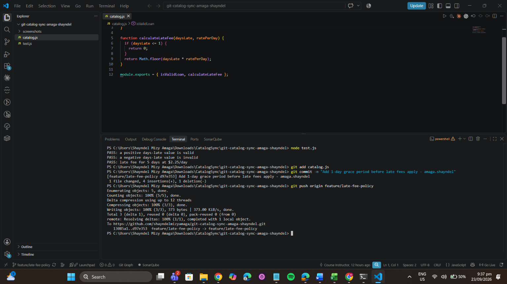
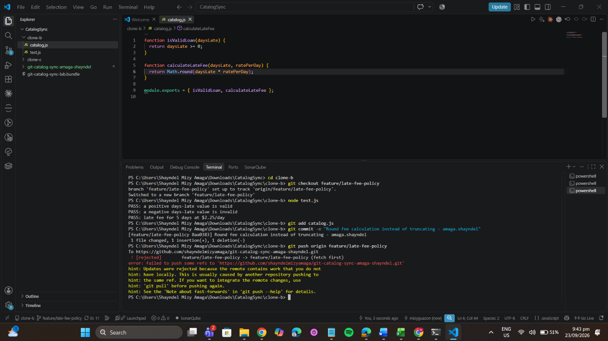
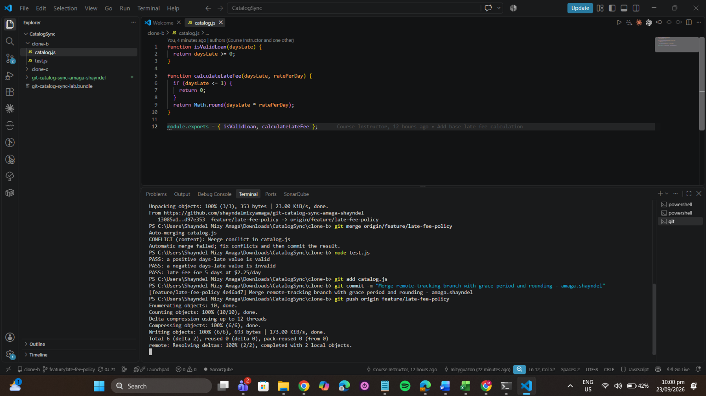
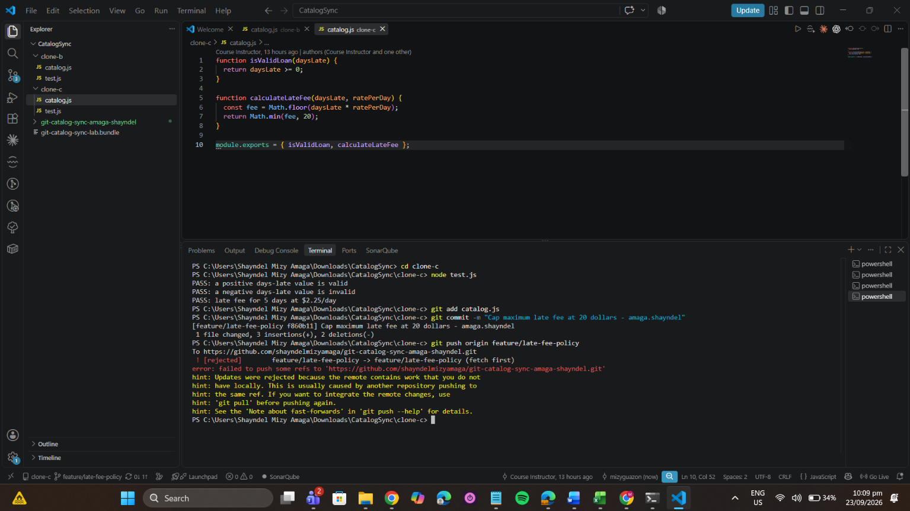
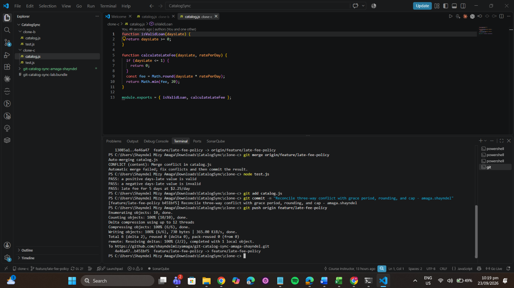
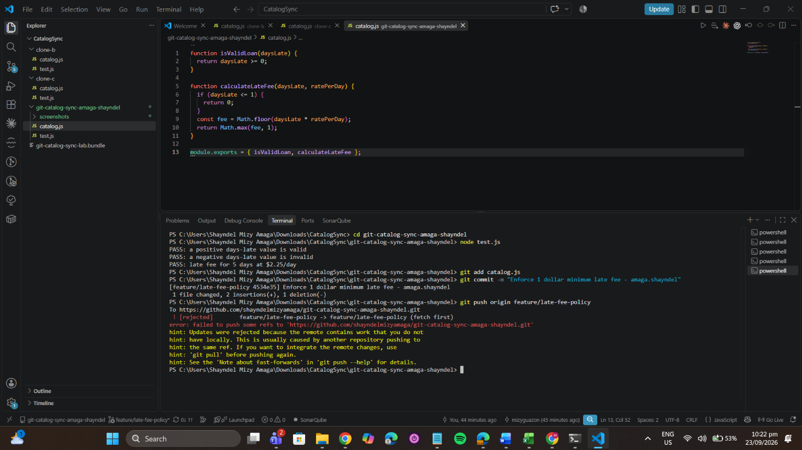
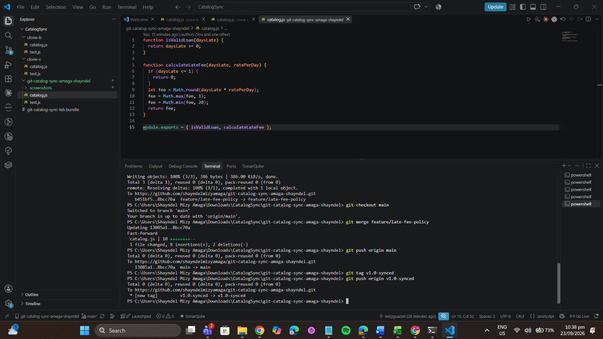

Catalog Sync: Reconciling 3-Way Divergent Work

Contributor: Shayndel Mizy G. Amaga (amaga.shayndel)
Repository: git-catalog-sync-amaga-shayndel

1. Walk through the final calculateLateFee function and name which contributor's change is responsible for each part.

The final calculateLateFee function combines the different changes made from the three clones.

- 1-Day Grace Period – Clone A, Task 1
   The condition if (daysLate <= 1) return 0; came from Clone A. This means that if the item is only 1 day late or less, the user will not be charged any late fee.

- Fee Rounding – Clone B, Task 2
   Clone B changed the fee calculation to use Math.round(daysLate * ratePerDay). Instead of just cutting off the decimal value, the fee is now rounded to the nearest whole number.

- $1.00 Minimum Fee – Clone A, Task 6
   The fee = Math.max(fee, 1); was also added by Clone A. This makes sure that once a late fee is charged after the grace period, the minimum amount will be $1.00.

- $20.00 Maximum Cap – Clone C, Task 4
   Clone C added fee = Math.min(fee, 20); so that the late fee will not go beyond $20.00 even if the item has been overdue for many days.

2. Compare Task 3's two-way conflict to Task 5's three-way conflict — what got harder with a third line of work?

In Task 3, the conflict was easier because I only had to combine two changes, which were Clone A's grace period and Clone B's fee rounding. The conflict was more direct since there were only two versions of the code that needed to be checked and combined. In Task 5, it became more difficult because Clone C was still based on the older version, while the remote branch already had the changes from Clone A and Clone B. I had to make sure that Clone C's $20 fee cap would still work properly with the grace period and rounding that were already added. The harder part was not only fixing the conflict markers, but also checking the order of the logic. The grace period should happen first, followed by the fee calculation and rounding, then the minimum and maximum fee rules should still work without affecting each other.

3. What's the actual difference between how you resolved Task 5 (merge) and Task 6 (rebase)?

In Task 5, I used merge to combine Clone C's work with the updated remote branch. Git created a separate merge commit that connected the two different histories. This kept the history showing where Clone C originally separated from the other changes and where it was merged back again. In Task 6, I used rebase instead. Clone A's local minimum fee commit was temporarily removed, then the branch was updated to the latest remote version. After that, Git applied the minimum fee commit again on top of the updated branch. The main difference is that merge keeps the separate branch history and creates a merge commit, while rebase moves the local commit on top of the latest changes. Because of this, the history after rebase looked cleaner and more linear, and I was also able to push normally without using --force.

4. If this were a real team of three, what one process change would have prevented all three rejected pushes?

A better approach would be to use separate feature branches for each developer instead of everyone pushing directly to the same shared feature branch. For example, one developer could work on feature/grace-period, another on feature/rounding and another on feature/fee-cap. Before starting or merging their work, they should also pull the latest changes from the main branch. After finishing their task, they can create a Pull Request so the changes can be reviewed, tested, and merged one at a time. This would reduce rejected pushes and make conflicts easier to handle before the changes are added to the shared branch.

Screenshot Evidence

Task 1: Clone A Initial Push

Task 2: Clone B Push Rejection

Task 3: Clone B Merge & Push

Task 4: Clone C Push Rejection

Task 5: Clone C Three-Way Merge & Push

Task 6: Clone A Rejection & Rebase Push

Task 7: Main Merge & Tagging

